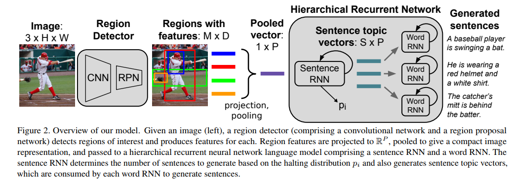
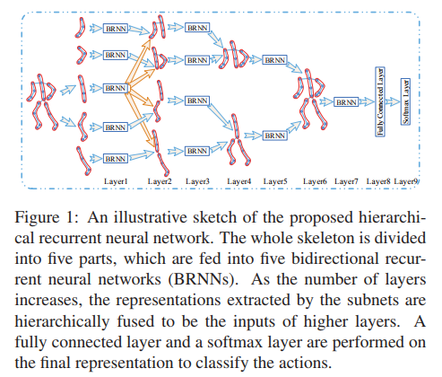

## A Hierarchical Approach for Generating Descriptive Image [[PDF] ](https://arxiv.org/pdf/1611.06607.pdf) *(CVPR 2017 Spotlight)*

This paper provides a hierarchical RNN to produce a paragraph caption of an image. 

The **sentence RNN** is responsible for generating topic vector, which encodes the information of the current sentence that needs to be generated.

Given the topic vector in the sentence RNN, the **word RNN** is responsible for generating word sequence.

Some details:

- This paper uses object detector **(*Faster RCNN***) to find region of interests in the image, then use **MaxPooling** to combine all features of these RoIs.

- Use weights from dense captioning to initialize object detection networks.

  ​

## Hierarchical Recurrent Neural Network for Skeleton Based Action Recognition [[PDF]](http://ieeexplore.ieee.org/document/7298714/) *(CVPR 2015, cited by 200+)*

This paper uses a **hierarchical RNN** to extract features from skeleton. Intuition is that: human body is composed in a hierarchy structure: **four limbs and trunk -> upper body and lower body -> whole body**. Human actions are composed of the motions of human body parts. Therefore, we could adopt a hierarchical NN to finds features of body skeleton thus fully utilizing this hierarchy structure.

One Thing I misunderstood at first is how this model do recurrent. Concretely, it perform recurrent over **time**, because the we could only derive the action from a sequence of skeleton. This is most interesting part!

Specifically, in the forward pass, this module will iterate until the final frame at each layer, after that it could forward into next layer. In each time step, the input is the current features of certain parts of body, therefore, the output could contain the information of the whole trajectory because of the properties of RNN.

Some details:

- It utilized **Bidirectional RNN** to get more meaningful features.
- Hierarchical combination is useful and proved in the experiments.

