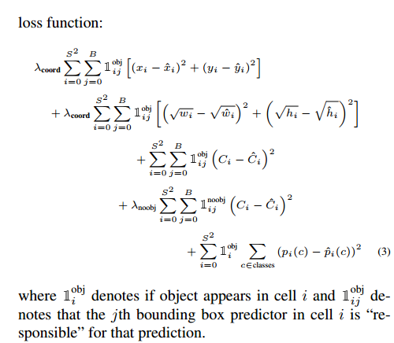

#YOLO
- Treat the classificaiton as regression problem, regress the BoundingBox coordinates, IOU confidence and class probabilities.
- Unified detection pipeline, divide the image into S*S grids and each grid is only responsible for one object. (different bbxs may improve accuracy?)
- Training target allocation, allocated the target to the maximum IOU prediction, which will encourage the bbx predictor do better and will not surpress the false bbx.
- Only 7*7*2 objects' bbxs in the final output, some large may be recognized by several bbxs, we do Non-Maximal Suppression.
- Liminitatoin: Each grid might output several bbxs but the same class, struggles at multi small objects.
- Looking at the loss function, you could get more insights.
  

------------------------------

#SSD
- High level idea: Multi scale feature map compared with Faster RCNN which only use the final layer as the feature map. Using features from lower layer to produce detection results and NMS to reduce the bbxs. 
- Each layer output $mnk(C+4)$ values with m*n means faature map's size, k is the number of relative bbx and C is the classes number.
- Matching Strategy: boxes whoes IOU exceed some threshold (0.5) relative to the ground truth and boxes who has the maximum IOU with the grounf truth. (Mose Essential)

